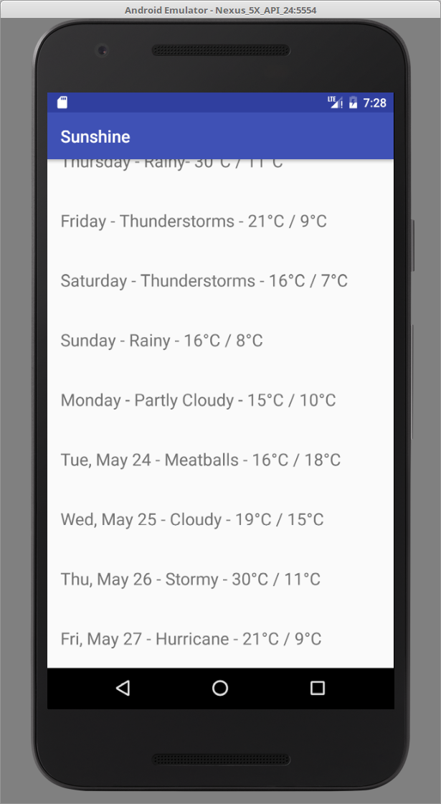

<link href="markdown.css" rel="stylesheet"></link>
<link href="img_style.css" rel="stylesheet"></link>

# MEET_2016-17_AP_Android
Android App Development Advanced project guide for MEET 2016-2017

We will be following the Udacity course at <https://www.udacity.com/course/new-android-fundamentals--ud851>. Go ahead and create an account on Udacity and check out the material.

Clone Repo

Nerd Ranch Guide. Install epub reader.

##Installing Android SDK

Begin by downloading [Android Studio](https://developer.android.com/studio/index.html). and then follow the installation instructions in <https://developer.android.com/studio/install.html> to install the SDK.

*Note:* You will need to install some packages first. On Ubuntu, run  in the terminal.

    sudo apt-get install libc6:i386 libncurses5:i386 libstdc++6:i386 lib32z1 libbz2-1.0:i386

##Getting Started

The first few lectures (under first lesson `Create Project Sunshine`) in the course are just basic overview and an introduction to Git. Feel free to skip ahead to *Creating our First project*. You should go through the material up to lecture 9 *Running your Code*.

    Objective: By the end of this section, you should have a simple app running on your emulator.

##Views and Layouts

Exercise Update layout : Either through Design or Text
Start watching the following lectures

* [*Lecture 12*](https://classroom.udacity.com/courses/ud851/lessons/93affc67-3f0b-4f9b-b3a4-a7a26f241a86/concepts/200e9ec2-a5ec-4e4b-b0d9-bdc0a02d705f#) -- Activities, Packages, and Layouts
* [*Lecture 14*](https://classroom.udacity.com/courses/ud851/lessons/93affc67-3f0b-4f9b-b3a4-a7a26f241a86/concepts/cdbfd437-de24-4903-8f01-37c29427cb38#) -- Android Layouts Primer
* [*Lecture 19*](https://classroom.udacity.com/courses/ud851/lessons/93affc67-3f0b-4f9b-b3a4-a7a26f241a86/concepts/43e77b25-5212-4a18-99c4-51f20d4e27e0#) -- Visual Layout Editor

Now you should be able to complete the five Exercises in this section. The final two (`Update Sunshine layout` and `Add Scrolling Weather`) are the more important ones. Make sure to test your apps on the emulator.

Exercise Scrolling Weather : Use dummy list of data. Get reference to the *TextView* in *onCreate*. Loop through data, and add each entry to text view with blank lines in between. After the final exercise, you should be able to scroll through a list of your dummy data.

    Objective: By the end of this section, you should be able to manipulate the basic View elements and create custom Layouts. 

##Listeners and Toasts

For this section we will create a new app. You should refer to the Nerd Ranch Guide Chapter 1. You have already seen how to create a basic application and add UI elements. The first steps are to create a basic layout. You can customize this and make it more elaborate if you want. Pay special attention to the section on `Creating String Resources`. After this, you will set IDs for each of your UI elements (in `Resources and Resource IDs`). As before, you will use these IDs to reference View objects later on.

The next section (`Wiring up Widgets`) shows you how to get the references to the Buttons and then elaborates how to set up listeners for click events from the buttons. Finally, complete the section on Toasts and you should have a working app with a single quiz question.

##Dynamic Views (Model-View-Controller)

In this section we will be coering the material in the Nerd Ranch Guide Chapter 2 up to *Updating the Controller View*. You will continue to work on the quiz app by adding more questions. The objective is to update the view so that it displays a new question upon pressing a *Next* button.

##Activity Lifecycle
In order to understand the basics of Activity lifecycles, watch the first four lectures in the *lifecycle* section of the Udacity course.

* [Introduction](https://classroom.udacity.com/courses/ud851/lessons/ed13cc93-2861-43bf-b7ed-395a166ab975/concepts/a7da9a33-219c-4b9b-9c01-cccaf51583e8#)
* [Why we Need ...](https://classroom.udacity.com/courses/ud851/lessons/ed13cc93-2861-43bf-b7ed-395a166ab975/concepts/aaa47e59-22b9-42b3-a89f-f8526c8db37f)
* [Android Activity lifecycle](https://classroom.udacity.com/courses/ud851/lessons/ed13cc93-2861-43bf-b7ed-395a166ab975/concepts/36769da8-9092-4342-b3b4-451aaa2cc80e#)
* [Reto](https://classroom.udacity.com/courses/ud851/lessons/ed13cc93-2861-43bf-b7ed-395a166ab975/concepts/9f8e379f-8bcc-419a-849f-4307eefbd047#)

##Adding more Activities

Now, we will go through Chapter 5 of the Nerd Wranch Guide. Here, you will learn how to add more activities to your app. Specifically, we will add a `Cheat` button to your quiz app from two sections ago. This will provide the answer to a question on a new page (Activity). To accomplish this, you must first create a new activity for the cheat page and construct the views for it.

Next, you should go thorough the sections `Starting an Activity` and `Passing Data between Activities`. These sections elaborate how to start new activities using *Intents*, and how to communicate and pass data between them using *Intent Extras*.

